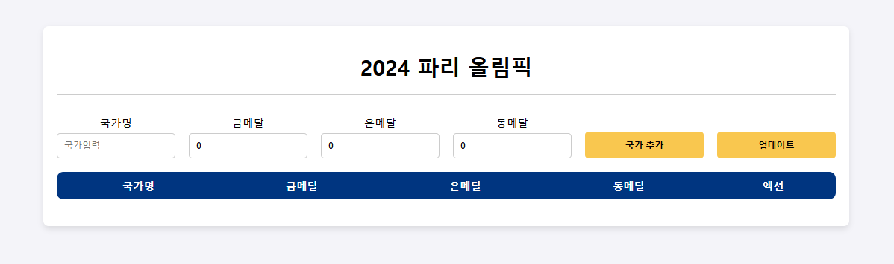

<!-- ####### 헤더 -->

# :trophy: 2024 Paris Olympics Medal List Page

2024년 파리 올림픽의 국가별 메달수를 추가하고 업데이트 할 수 있습니다.

 

 
 
<!-- ####### 프로젝트 소개 -->

<!-- 제목 -->

## :microphone: Project Introduction
 

<!-- 기간 -->

### :heavy_check_mark: **Development Period**
2025/01/21 ~ 2025/01/24

 
<!-- 테크 스택 -->

### :heavy_check_mark: **Tech Stack**

리액트 React를 사용하여 만들어진 프로젝트입니다.

 
 
<!-- ####### 프로젝트 특징 -->

<!-- 제목 -->

## :sparkles: Project Features
 
<!-- 특징 하나 -->

### :heavy_check_mark: **State**

React의 useState를 활용하여 실시간으로 정보가 바뀌도록 했습니다.

> - add country 버튼으로 나라의 정보를 곧바로 추가할 수 있습니다.
>
> - update 버튼을 통해 나라의 메달 수를 변경할 수 있습니다.
>
> - delete 버튼으로 정보를 삭제할 수 있습니다.
>

 
 

## :paperclip: Tech Blog Address

 

https://rinny01.tistory.com/

 
 
